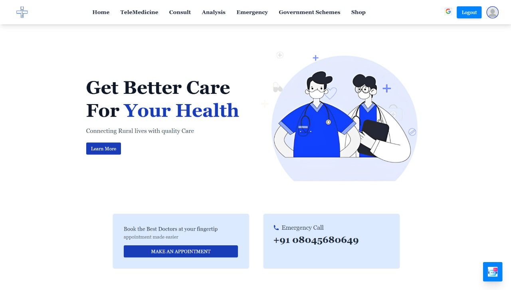
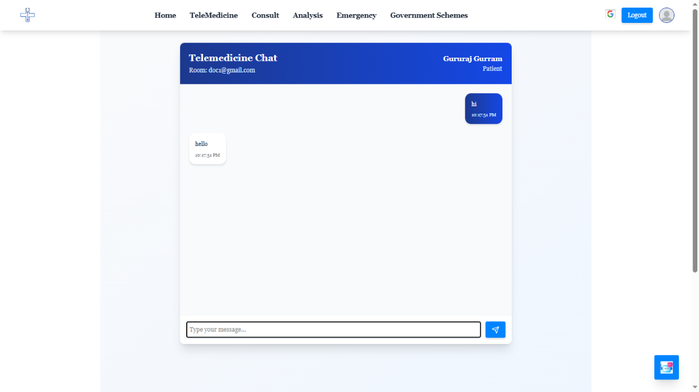
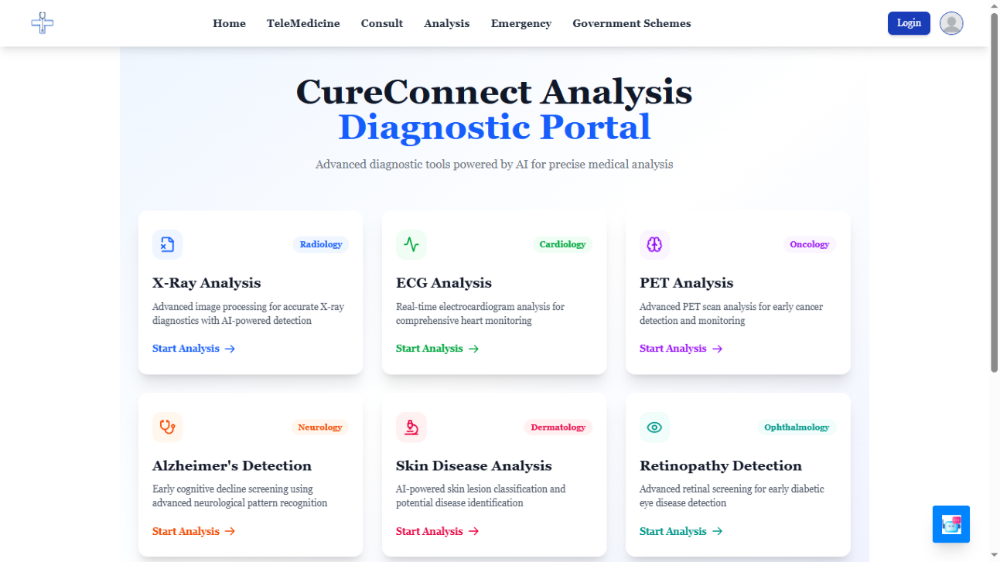
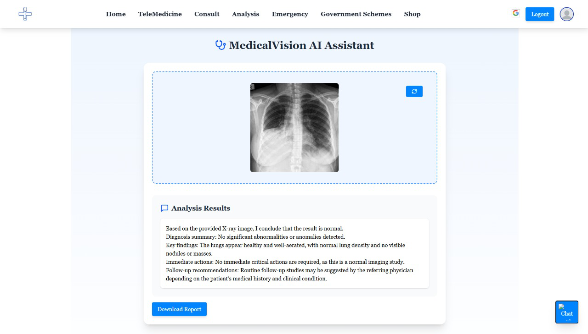
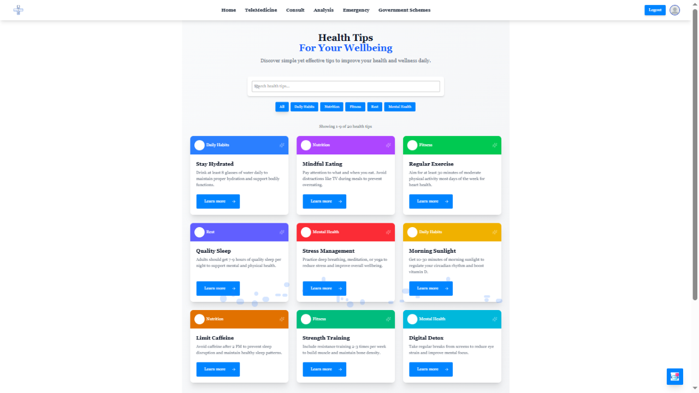
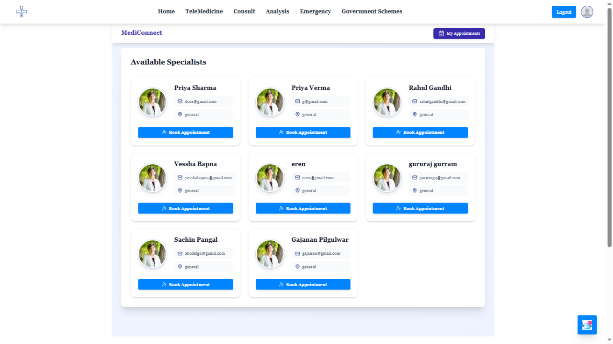
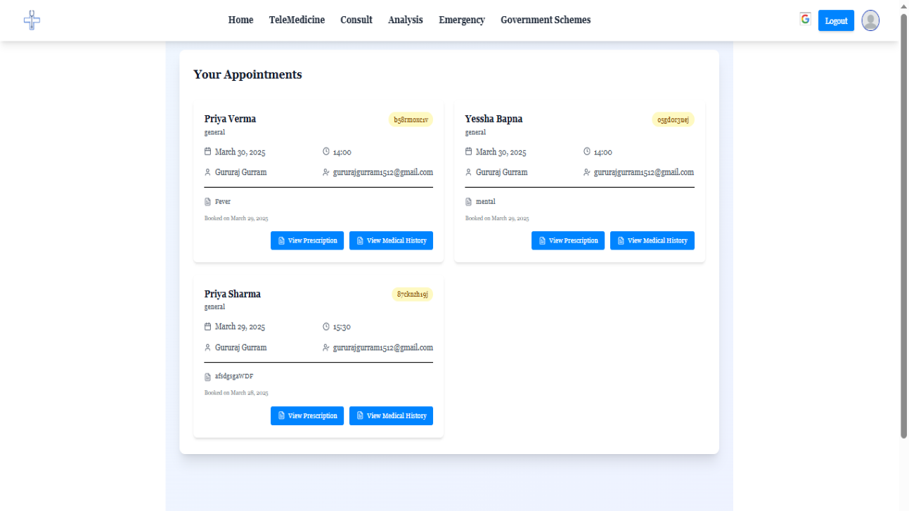
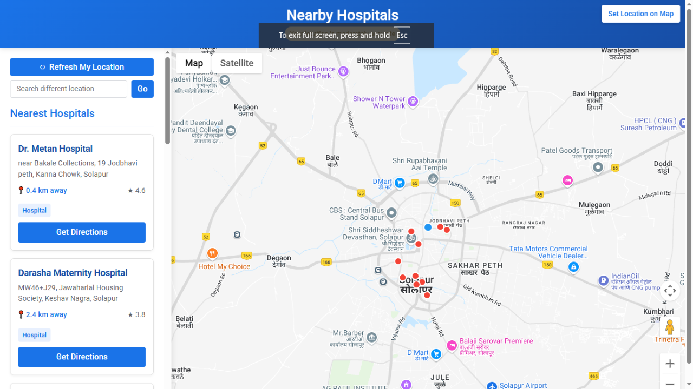
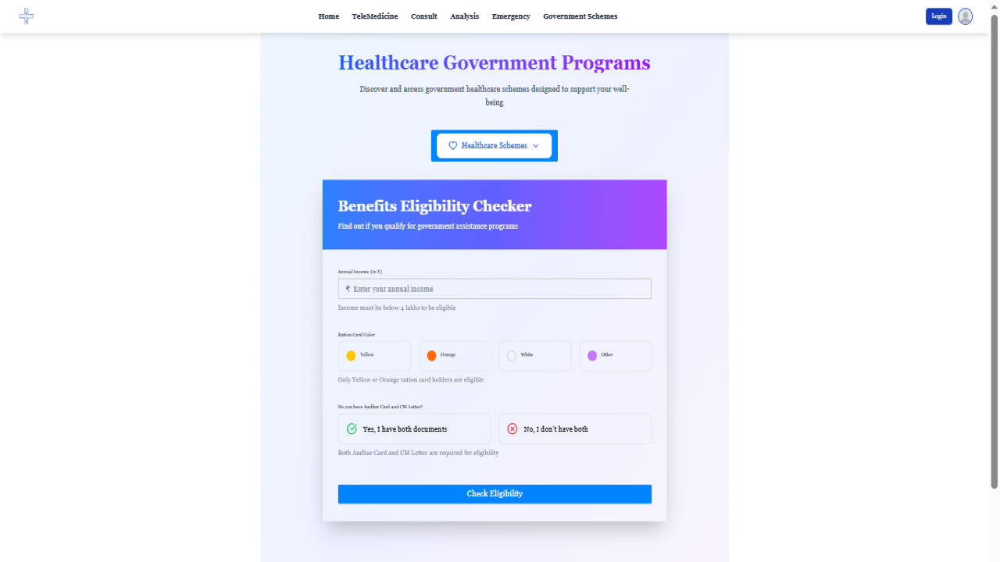

# Cureon - AI Powered Low-Bandwidth Telemedicine Platform for Rural Areas

## About Cureon

Cureon is a next-gen AI-powered telemedicine platform designed to bring accessible, affordable, and efficient healthcare to remote areas. Whether you have low internet bandwidth, no smartphone, or need AI-driven diagnostics, Cureon ensures seamless medical support for everyone.

## Our Features

### 1.  HD Video Calling via WebRTC (Optimized for Low Bandwidth) 📡

- Enables real-time doctor-patient consultations even in areas with limited internet speed.
- It automatically adjusts video quality based on internet speed, so calls stay smooth even on slow networks like 2G or  3G.

### 2. Offline Doctor Chat with WebSockets 🔒

- Patients can send messages to doctors even with no internet connectivity.
- Uses WebSockets for real-time, lightweight, and encrypted chat, reducing dependency on high-speed internet.

### 3.  AI/ML-Based Diagnostics 🩺

- Uses CNN & LSTM models to analyze ECG, X-ray, Retinopathy, PET scans, Skin diseases, and Alzheimer’s.
- Provides instant AI-generated reports, reducing diagnostic delays in rural areas.

### 4. RAG-Powered AI Chatbot 🤖

- Uses Retrieval-Augmented Generation (RAG) to provide context-aware, accurate health responses.
- Patients can get personalized health tips, symptom checks, and self-care advice in multiple languages.

### 5.Appointment Booking System 💳📝

- Patients can schedule consultations with doctors, ensuring timely medical assistance.
- Integrated with a secure payment gateway for hassle-free online payments.
- Generates digital prescriptions, reducing paperwork and enhancing record-keeping.

### 6.  IVR-Based Emergency Assistance & Hospital Locator 🚨☎️

- Patients can call an IVR number to connect with emergency medical services, even without a smartphone
- SOS feature auto-routes calls to nearest hospitals & ambulances, ensuring quick response times.
- After receiving a digital prescription from the doctor, patients can locate nearby medical stores for easy access to medicines.

### 7.  Multilingual & Voice-Assisted Accessibility 🗣️👁️

- Supports multiple regional languages, breaking language barriers in healthcare access.
- Integrated voice assistance for visually impaired users, ensuring accessibility for all

### 8. E-Commerce for Affordable Medicine Delivery 💊🏪

- Patients can order medicines at subsidized rates, reducing costs for rural healthcare.
- Ensures doorstep delivery, eliminating the need to travel long distances for essential medication.

### 9. Government Healthcare Programs & Eligibility Checker 🏥📜

- Provides users with an easy way to discover healthcare schemes they may qualify for.
- A dedicated tool to verify eligibility for government healthcare assistance based on income and ration card category.
- Users can check if they meet the criteria by entering their income, selecting their ration card color, and confirming necessary documents.
- Requires Aadhaar and CM Letter for authentication, making the eligibility process transparent and secure.

## Why Choose Cureon?

- **Accessibility**:  Get 24/7 healthcare support, even in remote areas with low or no internet.
- **Affordability**: Minimize healthcare costs with AI diagnostics, digital prescriptions, and online consultations.
- **Efficiency**: Instantly connect with doctors, book appointments, and receive quick diagnoses.
- **Comprehensive Care**: From consultations to AI-powered diagnostics, emergency assistance, and medicine delivery—all in one platform.
- **Data Security**:Your health data is encrypted and protected with advanced security measures.

## Get Started Today

Join, thousands of satisfied users who have made Cureon their preferred healthcare platform. Sign up now and take the first step towards convenient, efficient, and quality healthcare.

---

© 2025 Cureon. All rights reserved...

